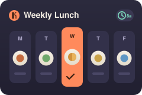

  

# Weekly Lunch Assistant

  

Didn't work? Create a Minds workspace and paste this to your agent:
` /use-template https://github.com/matthewboulos/inspiration-lunch`

## Why you care

Deciding what to eat for lunch every day is a small decision you make over and
over, and "eat something healthy" quietly loses to "eat whatever's easy." This
turns the week's lunches into one quick review: it does the menu research against
your own nutrition targets, proposes complete, verified-real dishes for each day,
and then nudges you at lunchtime so you actually order the thing you chose.

## How to use it

Once it's set up, the weekly rhythm looks like this:

1. **It reads the week.** From your team's Notion "Lunch" page, it pulls the
   coming week's restaurants for each weekday.
2. **It proposes options.** For every weekday it gives you 2-3 complete lunch
   options -- each a single, definite, verified-real dish that meets your
   nutrition spec, with estimated macros. It presents the whole week in chat.
3. **You pick.** Reply with your choices (e.g. "Tue 1, Wed 2"). Nothing is
   written until you do.
4. **It records the picks.** It writes each chosen order onto your line in the
   Notion doc (the order spec only -- no eating notes).
5. **It reminds you.** For each chosen day it schedules a one-shot 8am reminder
   that DMs you that day's dish plus any portion guidance over Slack, then
   removes itself.

It runs automatically on Sunday evenings via the weekly-lunch cron automation,
and you can also trigger it on demand any time -- re-running for a week that's
already planned is safe (it stops early).

Your nutrition targets and operating rules live in your own preference notes; the
template ships generalized examples under
`.agents/skills/weekly-lunch/example-preferences/` to copy and edit.

## Ideas for making it yours

- **Retune the nutrition spec.** Change the calorie band, protein floor, or plate
  ratio in your preference notes -- or swap the whole spec for a different goal
  (higher protein, lower carb, vegetarian-only).
- **Change the reminder time.** Move the 8am DM earlier or later, or send a
  second reminder (e.g. an evening "prep tomorrow's lunch" nudge).
- **Recommend for more than one person.** Have it plan for a partner or a whole
  team, writing each person's picks onto their own Notion line.
- **Send reminders somewhere else.** Point the reminder at a group channel, or
  swap Slack for email or another messenger.
- **Add a source alongside Notion.** Pull the week's options from a spreadsheet,
  a menu API, or a delivery service instead of (or in addition to) the Notion
  page.

## What this is

This repository is a published **minds template**: a clean, bootable
snapshot of what a mind built, ready to adapt into your own. It is NOT the
generic workspace template -- it is this specific project.

[`template.md`](template.md) is the full manifest -- what it is, how it
works, what it needs to run, and what to adapt -- with the
machine-readable half (recipe, requirements, and the environment it needs
installed) in [`template.toml`](template.toml).
